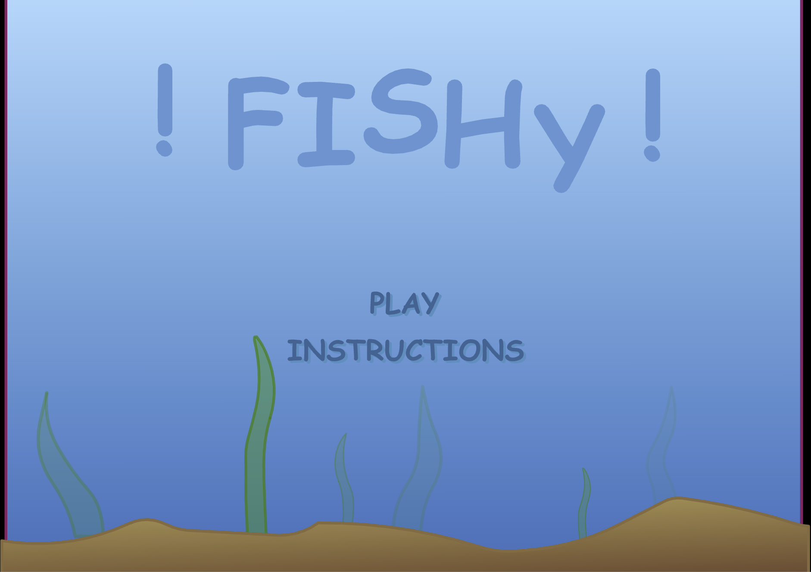
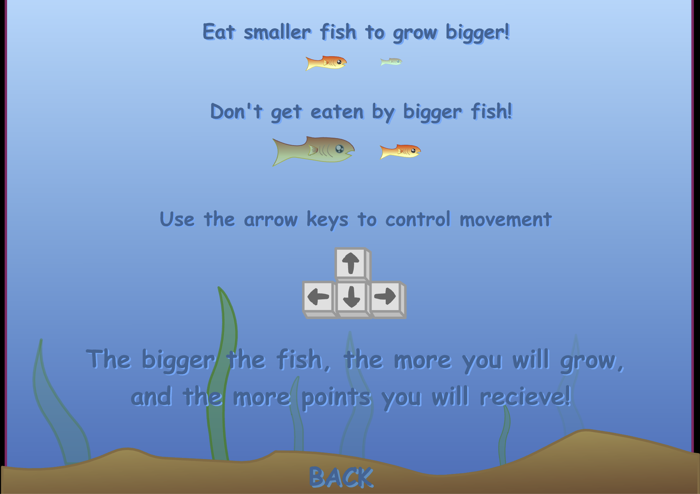
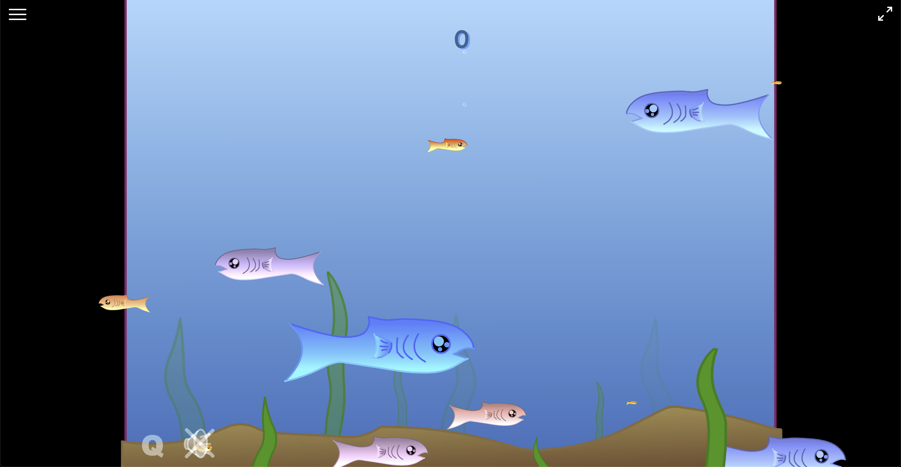
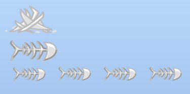
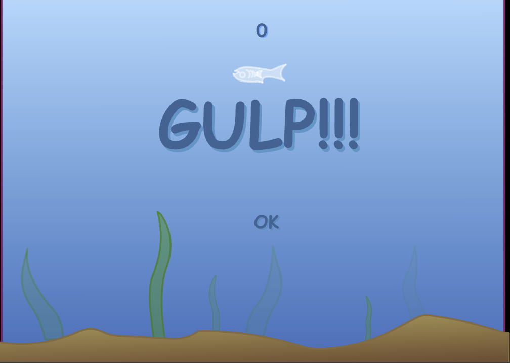
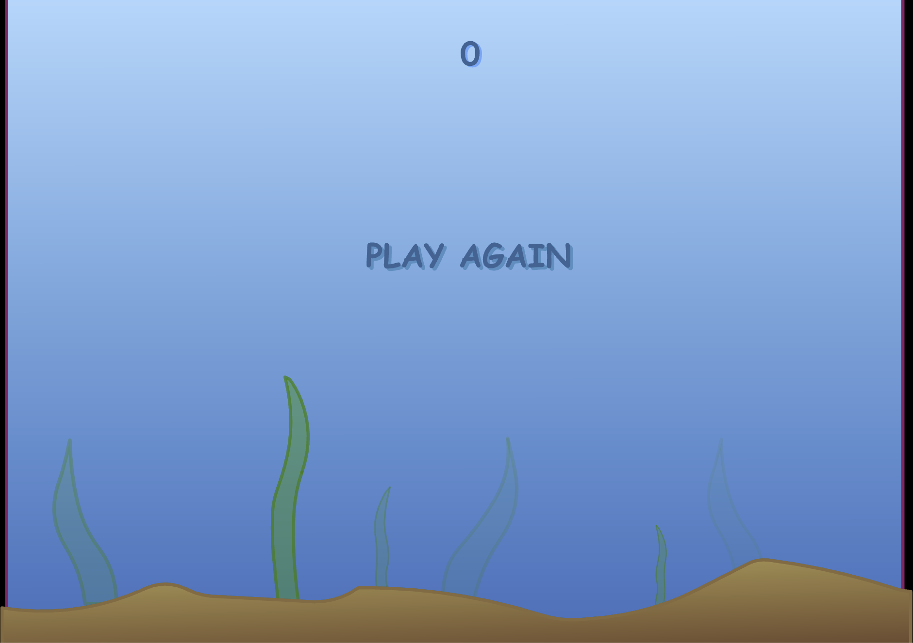

# Spec for recreating Fishy

Screenshots of the original game are provided for reference.

## Requirements

- Draw colored shapes instead of using graphical assets.
- No audio. Completely silent.
- Font style: Comic Sans
- Font color: Sea dark blue
- All clickable "buttons" enlarge instantly when hovered.
- White fullscreen icon at the top right edge toggles fullscreen mode.
- Consistent aspect ratio. Black background for part of the screen which exceeds the play area (where the player fish can move).

## Screen-by-screen breakdown

### Main menu screen

- Each character in the title bounces up/down independently.
- "PLAY" is clickable and immediately starts a new game.
- "INSTRUCTIONS" navigates to the instructions screen.

### Instructions screen

- "BACK" is clickable and navigates to the main menu screen.

### Play screen (actual game)

 Ignore the following elements in the screenshot. Pretend they don't exist:

- Top-left hamburger menu
- Bottom left "Q" and speaker icons

#### Movement

- Use the arrow keys or WASD to move
  - When opposing keys are pressed:
    - Up overrides down
    - Left overrides right
- Movement has a bit of momentum (can't instantly switch directions)
- Momentum decays over time
- Hitting the top/bottom edge instantly stops momentum in that direction.
- Hitting the left/right edge teleports the player fish to the other side while preserving momentum.
- The game starts with the player fish at the top end of the play area, going downwards fast.

#### Play area

The player can move in a rectangle, width > height.

#### Non-player fish

Non-player fish spawn from the left and right edges of a rectangle that's wider than the play area. Fish always spawn with their hitbox as far as possible from the center. When a fish spawns from the left, the right edge of its hitbox is at the left edge of the spawn area.

#### Handling fish collisions

When the player fish comes into contact with another fish:

- If the player is equal size or larger:
  - Player fish size increases very slightly (should be barely perceptible).
  - Player fish size increase scales with amount of fish eaten. It is not affected by the size of the eaten fish.
- If the player is smaller:
  - Game ends with game over screen.

All fish have a single rectangle hitbox.

#### Fishbone counters

- Top left of the screen
- 3 levels
- Lowest level (smallest fishbone) corresponds to 1 fish eaten
- Each level is equivalent to 5 of the previous level
- Screenshot shows 34 total fish eaten:
  - 1x25
  - 1x5
  - 4x1
- Lower 2 levels never have more than 4 as the 5th would reset them and add to the next level
- Level 3 has no cap and the counter can go all the way to the right edge of the screen
- Fishbone counters persist in the game over and play again screens.

#### Points

- Score counter at the top center of the play area.
- Increases when the player eats another fish based on size of eaten fish. Bigger fish yield more points.
- Score counter persists in the game over and play again screens.

#### Animation

- Player's fish produces air bubbles at semi-random intervals.
  - Starts around the fish's mouth and travels upward with a semi-random constant speed.
- Non-player fish play swimming animation constantly
- Player fish play swimming animation only when movement keys are pressed
- Player fish pulses slightly when eating other fish

### Game over screen

- "OK" button is clickable, navigates to play again screen
- Fish ghost starts below "OK" and travels upward with constant speed until it stops above "GULP!!!"

### Play again screen

- "PLAY AGAIN" is clickable and immediately starts a new game
